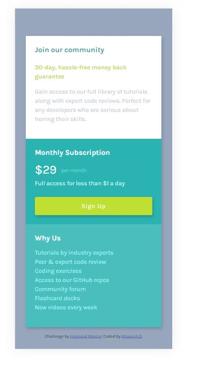

# Frontend Mentor - Single price grid component solution

This is a solution to the [Single price grid component challenge on Frontend Mentor](https://www.frontendmentor.io/challenges/single-price-grid-component-5ce41129d0ff452fec5abbbc). Frontend Mentor challenges help you improve your coding skills by building realistic projects. 

## Table of contents

- [Overview](#overview)
  - [The challenge](#the-challenge)
  - [Screenshot](#screenshot)
  - [Links](#links)
- [My process](#my-process)
  - [Built with](#built-with)
  - [What I learned](#what-i-learned)
  - [Continued development](#continued-development)
  - [Useful resources](#useful-resources)
- [Author](#author)

**Note: Delete this note and update the table of contents based on what sections you keep.**

## Overview

### The challenge

Users should be able to:

- View the optimal layout for the component depending on their device's screen size
- See a hover state on desktop for the Sign Up call-to-action

### Screenshot



### Links

- Solution URL: [Code](https://github.com/bhaveshdaswani93/single-price-grid-component-master)
- Live Site URL: [Live Site](https://single-price-grid-component-master-ruddy-two.vercel.app/)

## My process
- Used Mobile First approach
- For Responsive support used grid layout

### Built with

- Semantic HTML5 markup
- CSS custom properties
- CSS Grid
- Mobile-first workflow
- [Bootstrap](https://getbootstrap.com/) - CSS Framework

### What I learned

Learned to use Mobile first approach using CSS grid, and how easy the css grid make easy for 2 dimensional layout

```css
.wrapper {
  display: grid;
  grid-template-columns: 1fr;
  margin-top: 64px;
  margin-left: 16px;
  margin-right: 16px;
  box-shadow: 2px 4px 8px rgba(0, 0, 0, .2);

  @media screen and (min-width: 768px) {
    grid-template-columns: repeat(2, 1fr);
  }
  /* padding: 1rem; */
}
```

### Continued development

Want to use more of bootstrap classes, that will help in speed development.

## Author

- Frontend Mentor - [@bhaveshdaswani93](https://www.frontendmentor.io/profile/bhaveshdaswani93)
- Twitter - [@digitaldaswani](https://twitter.com/digitaldaswani)
